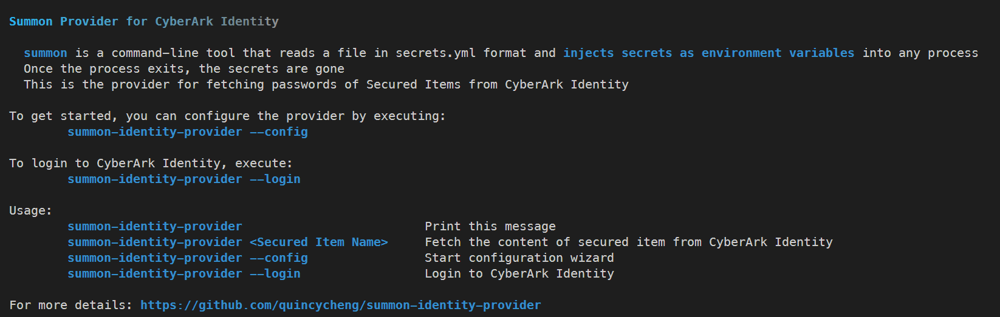

# Summon Provider for CyberArk Identity

 [](https://svgshare.com/i/Zhy.svg) [](https://svgshare.com/i/ZjP.svg)  [](https://svgshare.com/i/ZhY.svg) 

 [](https://github.com/quincycheng/summon-identity-provider/actions/workflows/goreleaser.yml)  [](https://github.com/quincycheng/summon-identity-provider/actions/workflows/codeql-analysis.yml)




summon is a command-line tool that reads a file in secrets.yml format and injects secrets as environment variables into any process. Once the process exits, the secrets are gone
This is the summon provider for fetching passwords of Secured Items from CyberArk Identity

## Quick Start

### Step 1. Config the Provider  

To get started, download the provider from [releases](https://github.com/quincycheng/summon-identity-provider/releases) & start the configuration wizard by executing:
```
summon-identity-provider --config
````

Note: You only need to do it once

### Step 2: Login

To log in to CyberArk Identity, execute:
```
summon-identity-provider --login
```

If you have logged in already and your authentication token is still valid, this command will refresh your token.
Otherwise, you will be prompted to provide necessary information, such as password, to login.

This is recommended to execute this command before fetching secured items

### Step 3 (optional): Fetching secured item using this provider

To verify the setup, you can execute the following command to display the content of the secured item from CyberArk Identity
```
summon-identity-provider <Secured Item Name>
```


### Step 4: Prepare summon & your command

If summon hasn't been installed, follow [this guide](https://github.com/cyberark/summon#install) 


To inject secured item using summon, replace your settings & execute the following command:
```
<path to provider>/summon-identity-provider --login \
summon -p <path to provider>/summon-identity-provider \
    --yaml '<Env Var Name>: !var "<Secured Item Name>"' \
    <your command with env variable available>
```

There are many ways to utilize summon to inject secrets or secured items. More examples can be found at [Examples](#Examples) section below

## Usage

```
summon-identity-provider                         Print this message
summon-identity-provider <Secured Item Name>     Fetch a password of Secured Item from CyberArk Identity
summon-identity-provider --config                Start configuration wizard
summon-identity-provider --login                 Login to CyberArk Identity
```


## Config
Configuration will be saved in user configuration folder

- On Unix systems, it is `$XDG_CONFIG_HOME` as specified by https://specifications.freedesktop.org/basedir-spec/basedir-spec-latest.html if non-empty, else `$HOME/.config`
- On MacOS (Darwin), it is `$HOME/Library/Application Support`
- On Windows, it is `%AppData%`

## Secured Item Types

### Supported (Tested)
 - Secured Notes
 - Password

## Authentication Mechanisms

### Supported (Tested)
 - Password
 - Text message (SMS) confirmation code	
 - Text message (SMS) authentication link
 - Email confirmation code	
 - Email authentication link	
- Mobile Authenticator	


### Supported (Should work but not yet tested)
 - Security Question
 - Phone call

### Not Supported
 - Social Login
 - OATH OTP Client
 - QR Code	
 - FIDO2 Authenticator (single factor & multi-factor)
 - 3rd Party RADIUS Authentication	
 - Duo

## Supported Platforms

- MacOS (amd64 & arm64)
- Linux (x86, amd64 & arm64)
- Windows (x86, amd64 & arm64)

## Examples

### Shell Scripts for injection secured items as environment variables (macOS / Linux)

To use shell scripts for injection secured items using summon, you can prepare an executable script as below:
```
#!/bin/sh

<path to provider>/summon-identity-provider --login \
summon -p <path to provider>/summon-identity-provider \
    --yaml '<Env Var Name>: !var "<Secured Item Name>"' \
    <Your command with env variable available>
```

For example, to fetch the secured item named `My Secured Item`, inject it as `ITEM` environmental variables and display it using `echo $ITEM`, execute:
```
#!/bin/sh

summon-identity-provider --login && \
summon -p ./summon-identity-provider \
    --yaml 'ITEM: !var "My Secured Item"' \
    sh -c 'echo $ITEM'
```

### Alias for injection secured items as environment variables (macOS/Linux)

To set up alias for injection secured items using summon, you can prepare an executable script as below:
```
alias <alias name>=$'summon-identity-provider --login && \
summon -p <path to provider>/summon-identity-provider --yaml \'<Env Var Name>: !var "<Secured Item Name>\'  <you command>'
```

For example, to set up alias to fetch the secured item named `My Secured Item`, inject it as `ITEM` environmental variables and display it using `echo $ITEM`, execute:
```
alias alias1=$'summon-identity-provider --login && \
summon -p ./summon-identity-provider --yaml \'ITEM: !var "My Secured Item"\'  sh -c \'echo $ITEM\''
```

To verify the alias, execute:
```
alias1
```

### Shell Scripts for injection secured items as memory-mapped file (macOS / Linux)

To use shell scripts for injection secured items as memory-mapped file using summon, you can prepare an executable script as below:
```
#!/bin/sh

<path to provider>/summon-identity-provider --login \
summon -p <path to provider>/summon-identity-provider \
    --yaml '<Env Var Name>: !var:file "<Secured Item Name>"' \
    <Your command with env variable available>
```

For example, to fetch the secured item named `My Secured Item`, inject it as `ITEM_FILE` environmental variables and display the path using `echo $ITEM_FILE` & its content using `cat $ITEM_FILE`, execute:
```
#!/bin/sh

summon-identity-provider --login && \
summon -p ./summon-identity-provider \
    --yaml 'ITEM_FILE: !var:file "My Secured Item"' \
    sh -c 'echo file path: $ITEM FILE && cat $ITEM_FILE'
```


## Maintainer
 - Quincy Cheng